# Avaliação — Engenharia de Software
**Sistema Integrado de Gestão de Farmácia — MVP Definido pelo Estudante**

Aluno: Vinícius Rosas de Ávila  
RA: 25001340  
Data: 25/03/2026  

---

# 1. Definição do MVP

Meu MVP cobre o processo de venda de produtos na farmácia desde a identificação do cliente até a emissão do comprovante, incluindo consulta de produtos, verificação de estoque, cadastro rápido de cliente, validação de receita para medicamentos controlados, registro de venda à vista ou a prazo e atualização automática do estoque.

- **Dentro do MVP**
- Identificar cliente
- Cadastrar cliente rapidamente
- Consultar produto
- Verificar estoque
- Registrar venda
- Validar receita médica quando necessário
- Finalizar venda
- Emitir comprovante
- Registrar contas a receber em vendas a prazo
- Atualizar estoque automaticamente após a venda

  
- **Fora do MVP**
- Processo completo de compras com fornecedores
- Transferência entre unidades
- Contas a pagar
- Relatórios gerenciais completos
- Gestão avançada de usuários e permissões
- Controle de perdas e devoluções
- Indicadores estratégicos da matriz

- Essas escolhas foram feitas porque o processo de venda é o mais crítico para o funcionamento diário da farmácia. Ele impacta diretamente o atendimento ao cliente, o controle de estoque e a geração de receitas. Assim, o MVP prioriza a operação principal do negócio e entrega valor imediato com menor complexidade de implementação.

---

# 2. Regras de Negócio (mínimo: 5)
Liste e descreva **cada RN** de forma clara.

**RN01 —** Produtos sem estoque disponível não podem ser vendidos.

**RN02 —** Medicamentos controlados só podem ser vendidos mediante validação de receita por um farmacêutico.

**RN03 —** Toda venda finalizada deve atualizar automaticamente o estoque da unidade.

**RN04 —** Vendas a prazo devem gerar automaticamente um lançamento em contas a receber com vencimento e status inicial “Aberta”.

**RN05 —** O sistema deve permitir cadastro rápido de cliente durante a venda quando ele ainda não estiver registrado.

**RN06 —** O comprovante da venda deve ser emitido obrigatoriamente ao final da operação.

**RN07 —** Apenas gerentes podem alterar cadastro de produtos e preços.

**RN08 —** O sistema deve alertar quando o estoque de um produto atingir ou ficar abaixo do nível mínimo.

---

# 3. Requisitos Funcionais (mínimo: 8)
Liste os requisitos funcionais do seu MVP.

**RF01 —** O sistema deve permitir identificar clientes pelo nome, CPF ou código.

**RF02 —** O sistema deve permitir cadastrar clientes durante o atendimento.

**RF03 —** O sistema deve permitir pesquisar produtos por nome, código de barras ou fabricante.

**RF04 —** O sistema deve verificar a disponibilidade de estoque antes de adicionar o produto à venda.

**RF05 —** O sistema deve registrar vendas com um ou mais itens.

**RF06 —** O sistema deve permitir classificar a venda como à vista ou a prazo.

**RF07 —** O sistema deve gerar automaticamente contas a receber em vendas a prazo.

**RF08 —** O sistema deve emitir comprovante ao final da venda.

**RF09 —** O sistema deve atualizar automaticamente o estoque após a conclusão da venda.

**RF10 —** O sistema deve solicitar validação de receita para medicamentos controlados.

---

# 4. Requisitos Não Funcionais (mínimo: 4)
Liste os RNFs do sistema conforme seu MVP.

**RNF01 —** O sistema deve responder às consultas de produtos em até 3 segundos.

**RNF02 —** O sistema deve garantir autenticação de usuários por login e senha.

**RNF03 —** O sistema deve manter registro das operações realizadas para auditoria.

**RNF04 —** O sistema deve estar disponível durante o horário de funcionamento da farmácia com alta confiabilidade.

**RNF05 —** O sistema deve possuir interface simples e intuitiva para uso no balcão.

(Adicione mais se quiser.)

---

# 5. Casos de Uso (mínimo: 10)
### Inserir **diagrama de casos de uso geral**, demonstrando claramente:
- os 10 casos
- relação entre eles e atores
- pelo menos 3 includes
- pelo menos 3 extends
UC01 — Realizar Login
UC02 — Consultar Produto
UC03 — Identificar Cliente
UC04 — Cadastrar Cliente
UC05 — Registrar Venda
UC06 — Validar Receita
UC07 — Registrar Venda a Prazo
UC08 — Atualizar Estoque
UC09 — Emitir Comprovante
UC10 — Gerar Conta a Receber
UC11 — Registrar Compra
UC12 — Gerar Conta a Pagar
Includes usados
UC05 inclui UC02
UC05 inclui UC03
UC05 inclui UC09
UC07 inclui UC10
UC11 inclui UC08
UC11 inclui UC12
Extends usados
UC07 estende UC05
UC06 estende UC05
UC04 estende UC03
---

# 6. Documentação dos Casos de Uso

---

## UC01 — Realizar Login

**Ator(es):** Atendente, Farmacêutico, Gerente, Financeiro, Administrador  
**Descrição:** Permite que o usuário acesse o sistema conforme seu perfil.  
**Pré-condições:** Usuário cadastrado e ativo no sistema.  
**Pós-condições:** Usuário autenticado e com acesso liberado ao menu correspondente ao seu perfil.  

### Fluxo Principal
1. O usuário informa login e senha.  
2. O sistema valida as credenciais.  
3. O sistema identifica o perfil do usuário.  
4. O sistema libera o acesso ao ambiente principal.  

### Fluxos Alternativos / Exceções
- **FA01** — Login ou senha inválidos; o sistema informa erro.  
- **FA02** — Usuário inativo ou bloqueado; o sistema nega acesso.  

### Relacionamentos
- **Include:** não se aplica  
- **Extend:** não se aplica  

### Diagrama de Atividades

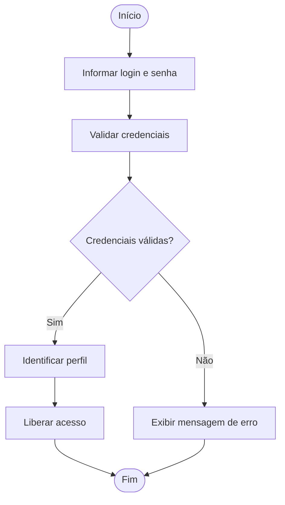

---

## UC02 — Consultar Produto

**Ator(es):** Atendente  
**Descrição:** Permite consultar informações de produtos cadastrados no sistema.  
**Pré-condições:** Usuário autenticado no sistema.  
**Pós-condições:** Informações do produto exibidas na tela.  

### Fluxo Principal
1. O atendente acessa a função de consulta de produtos.  
2. O atendente informa nome, código ou categoria do produto.  
3. O sistema pesquisa os dados no cadastro.  
4. O sistema exibe as informações encontradas.  

### Fluxos Alternativos / Exceções
- **FA01** — Produto não encontrado; o sistema informa que não há resultados.  
- **FA02** — Campo de busca vazio; o sistema solicita preenchimento.  

### Relacionamentos
- **Include:** não se aplica  
- **Extend:** não se aplica  

### Diagrama de Atividades

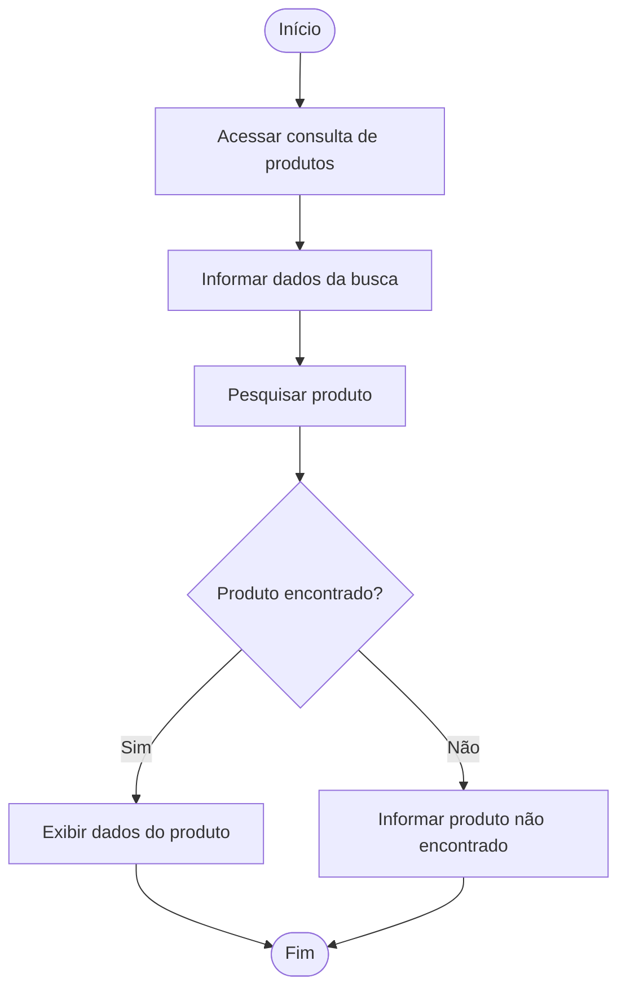

---

## UC03 — Identificar Cliente

**Ator(es):** Atendente  
**Descrição:** Permite localizar o cadastro do cliente antes da venda.  
**Pré-condições:** Usuário autenticado no sistema.  
**Pós-condições:** Cliente identificado ou ausência de cadastro informada.  

### Fluxo Principal
1. O atendente solicita a identificação do cliente.  
2. O cliente informa CPF ou outro dado cadastral.  
3. O sistema realiza a pesquisa no cadastro.  
4. O sistema exibe os dados do cliente localizado.  

### Fluxos Alternativos / Exceções
- **FA01** — Cliente não encontrado; o sistema informa ausência de cadastro.  
- **FA02** — Dados informados incorretamente; o sistema solicita nova digitação.  

### Relacionamentos
- **Include:** não se aplica  
- **Extend:** UC04 — Cadastrar Cliente  

### Diagrama de Atividades

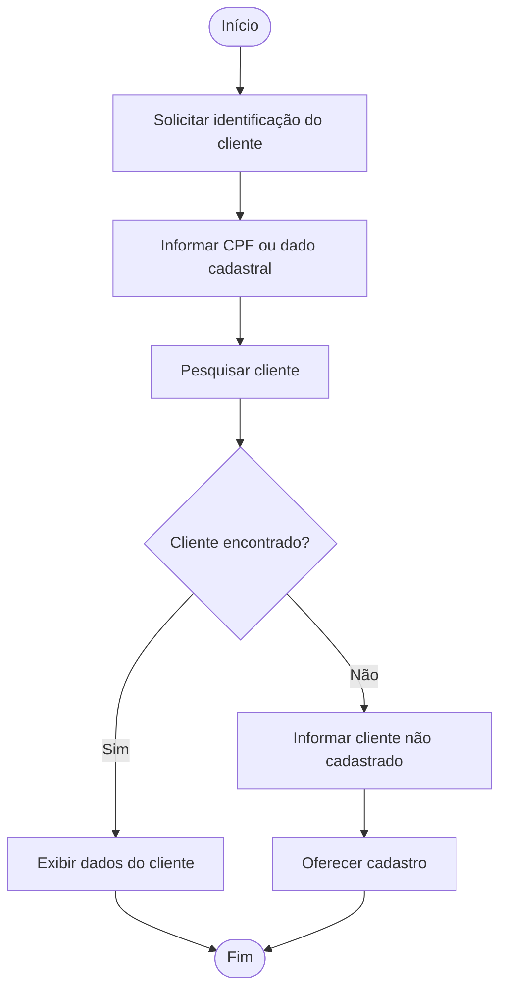

---

## UC04 — Cadastrar Cliente

**Ator(es):** Atendente  
**Descrição:** Permite registrar um novo cliente no sistema.  
**Pré-condições:** Cliente não cadastrado no sistema.  
**Pós-condições:** Cliente cadastrado com sucesso.  

### Fluxo Principal
1. O atendente seleciona a opção de cadastro de cliente.  
2. O atendente informa os dados pessoais do cliente.  
3. O sistema valida os dados informados.  
4. O sistema grava o cadastro do cliente.  

### Fluxos Alternativos / Exceções
- **FA01** — CPF já cadastrado; o sistema informa duplicidade.  
- **FA02** — Dados obrigatórios ausentes; o sistema solicita correção.  

### Relacionamentos
- **Include:** não se aplica  
- **Extend:** não se aplica  

### Diagrama de Atividades

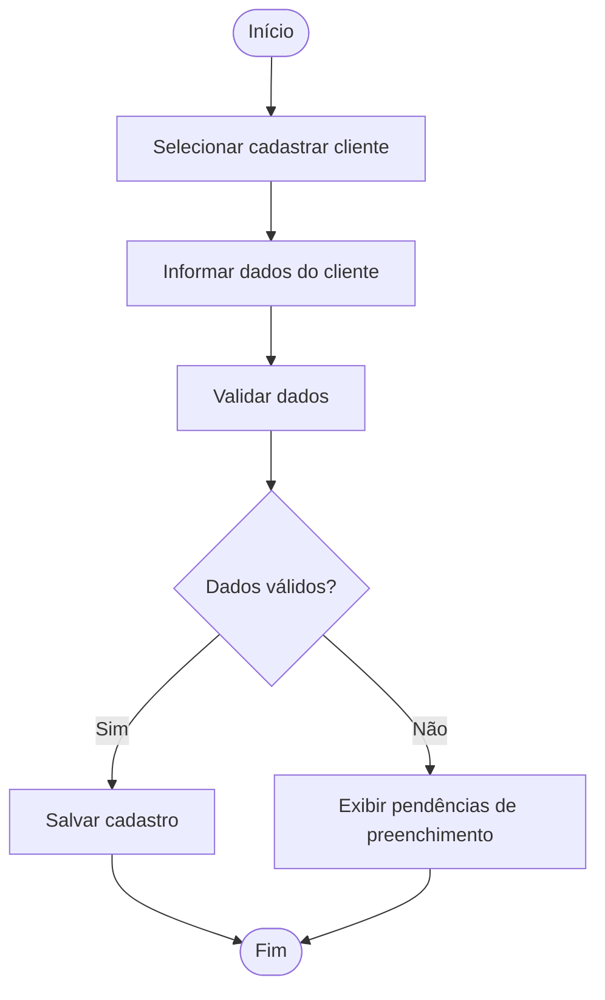

---

## UC05 — Registrar Venda

**Ator(es):** Atendente  
**Descrição:** Permite registrar a venda de produtos para o cliente.  
**Pré-condições:** Usuário autenticado e produto disponível para venda.  
**Pós-condições:** Venda registrada com sucesso no sistema.  

### Fluxo Principal
1. O atendente inicia o registro da venda.  
2. O sistema consulta o produto desejado.  
3. O sistema identifica o cliente.  
4. O atendente informa a quantidade.  
5. O sistema verifica o estoque.  
6. O sistema calcula o valor total.  
7. O sistema registra a venda.  
8. O sistema emite o comprovante.  

### Fluxos Alternativos / Exceções
- **FA01** — Estoque insuficiente; o sistema informa indisponibilidade.  
- **FA02** — Produto controlado; o sistema exige validação da receita.  
- **FA03** — Cliente deseja venda a prazo; o sistema aciona o processo correspondente.  

### Relacionamentos
- **Include:** UC02 — Consultar Produto; UC03 — Identificar Cliente; UC09 — Emitir Comprovante  
- **Extend:** UC06 — Validar Receita; UC07 — Registrar Venda a Prazo  

### Diagrama de Atividades

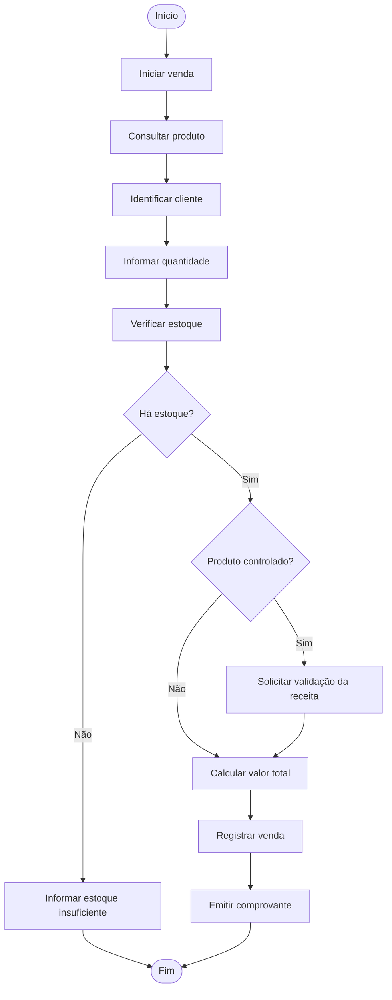

---

## UC06 — Validar Receita

**Ator(es):** Farmacêutico  
**Descrição:** Permite validar receitas médicas para medicamentos controlados.  
**Pré-condições:** Venda com produto sujeito a controle especial.  
**Pós-condições:** Receita validada ou venda bloqueada.  

### Fluxo Principal
1. O farmacêutico recebe a solicitação de validação.  
2. O farmacêutico analisa os dados da receita.  
3. O sistema verifica a conformidade das informações.  
4. O sistema autoriza a continuidade da venda.  

### Fluxos Alternativos / Exceções
- **FA01** — Receita vencida; o sistema bloqueia a venda.  
- **FA02** — Receita inválida ou incompleta; o sistema rejeita a validação.  

### Relacionamentos
- **Include:** não se aplica  
- **Extend:** UC05 — Registrar Venda  

### Diagrama de Atividades

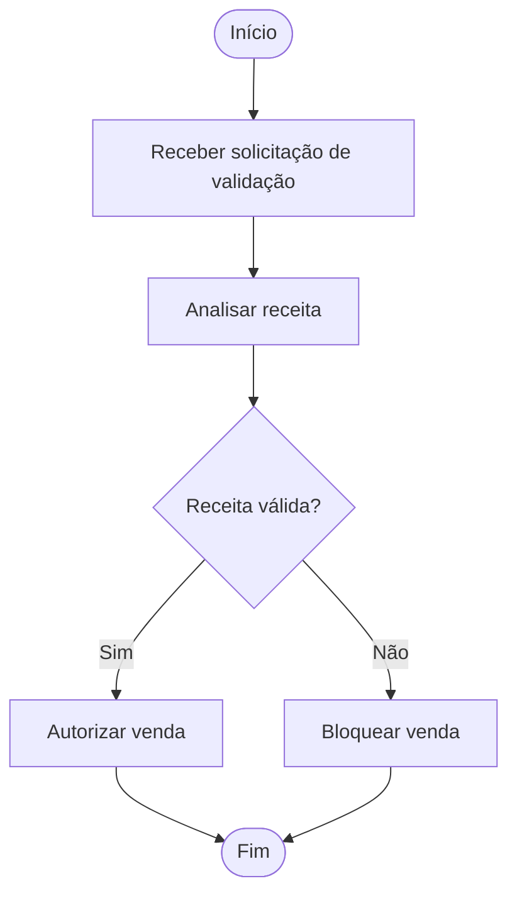

---

## UC07 — Registrar Venda a Prazo

**Ator(es):** Atendente  
**Descrição:** Permite registrar vendas com pagamento posterior.  
**Pré-condições:** Cliente identificado e elegível para compra a prazo.  
**Pós-condições:** Venda a prazo registrada e conta a receber gerada.  

### Fluxo Principal
1. O atendente seleciona a opção de venda a prazo.  
2. O sistema verifica a situação do cliente.  
3. O sistema confirma a autorização para compra a prazo.  
4. O sistema conclui a venda.  
5. O sistema gera a conta a receber.  

### Fluxos Alternativos / Exceções
- **FA01** — Cliente com pendências financeiras; o sistema nega a venda a prazo.  
- **FA02** — Limite de crédito excedido; o sistema bloqueia a operação.  

### Relacionamentos
- **Include:** UC10 — Gerar Conta a Receber  
- **Extend:** UC05 — Registrar Venda  

### Diagrama de Atividades

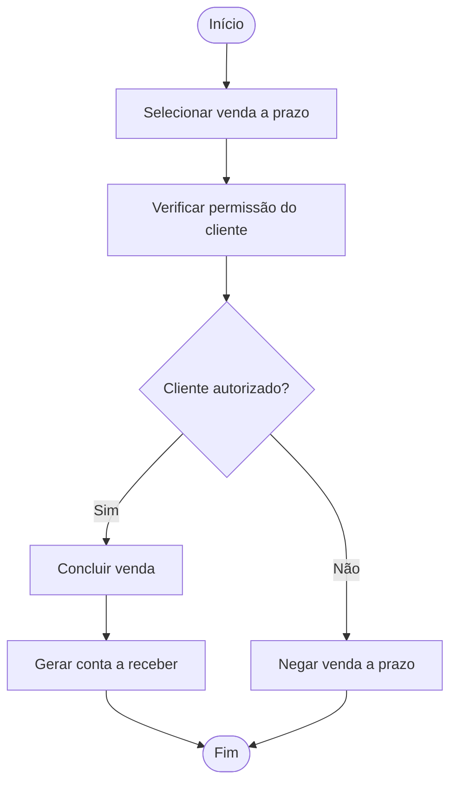

---

## UC08 — Atualizar Estoque

**Ator(es):** Gerente  
**Descrição:** Permite atualizar a quantidade de produtos no estoque.  
**Pré-condições:** Usuário autenticado com permissão de gerenciamento.  
**Pós-condições:** Estoque atualizado no sistema.  

### Fluxo Principal
1. O gerente acessa a função de atualização de estoque.  
2. O gerente informa o produto e a movimentação.  
3. O sistema calcula o novo saldo em estoque.  
4. O sistema salva a atualização realizada.  

### Fluxos Alternativos / Exceções
- **FA01** — Produto inexistente; o sistema informa erro.  
- **FA02** — Dados de movimentação inválidos; o sistema cancela a atualização.  

### Relacionamentos
- **Include:** não se aplica  
- **Extend:** não se aplica  

### Diagrama de Atividades

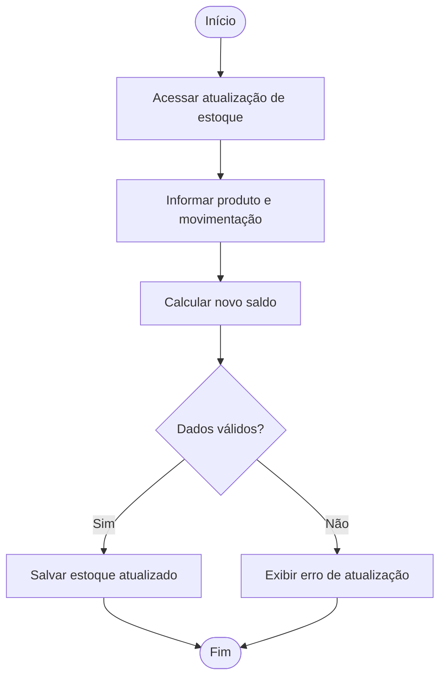

---

## UC09 — Emitir Comprovante

**Ator(es):** Atendente  
**Descrição:** Permite emitir o comprovante da venda realizada.  
**Pré-condições:** Venda concluída no sistema.  
**Pós-condições:** Comprovante impresso ou disponibilizado em formato digital.  

### Fluxo Principal
1. O sistema obtém os dados da venda.  
2. O sistema gera o comprovante.  
3. O sistema disponibiliza a impressão ou visualização digital.  
4. O sistema finaliza a operação.  

### Fluxos Alternativos / Exceções
- **FA01** — Impressora indisponível; o sistema disponibiliza versão digital.  
- **FA02** — Erro na geração do comprovante; o sistema informa falha.  

### Relacionamentos
- **Include:** não se aplica  
- **Extend:** não se aplica  

### Diagrama de Atividades

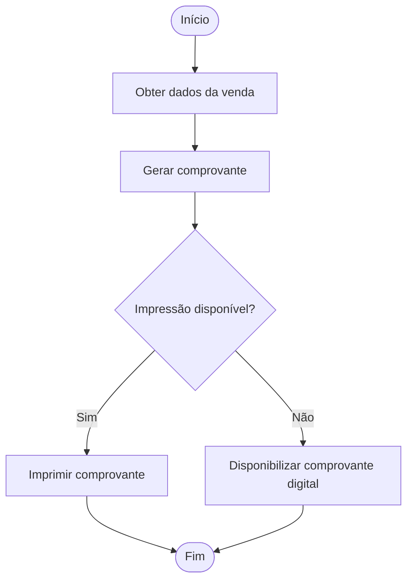

---

## UC10 — Gerar Conta a Receber

**Ator(es):** Financeiro  
**Descrição:** Permite gerar um registro financeiro referente às vendas a prazo.  
**Pré-condições:** Venda a prazo concluída no sistema.  
**Pós-condições:** Conta a receber registrada com status em aberto.  

### Fluxo Principal
1. O financeiro recebe os dados da venda a prazo.  
2. O sistema confirma valor e vencimento.  
3. O sistema registra a conta a receber.  
4. O sistema define o status inicial como aberta.  

### Fluxos Alternativos / Exceções
- **FA01** — Dados financeiros inconsistentes; o sistema informa erro.  
- **FA02** — Vencimento não informado; o sistema solicita correção.  

### Relacionamentos
- **Include:** não se aplica  
- **Extend:** não se aplica  

### Diagrama de Atividades

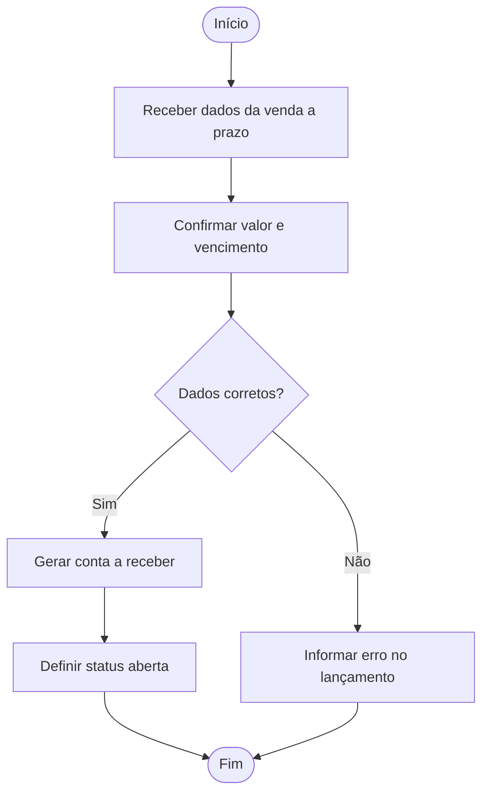

---

## UC11 — Registrar Compra

**Ator(es):** Gerente  
**Descrição:** Permite registrar compras de produtos para reposição de estoque.  
**Pré-condições:** Usuário autenticado com permissão para registrar compras.  
**Pós-condições:** Compra registrada, estoque atualizado e conta a pagar gerada.  

### Fluxo Principal
1. O gerente inicia o registro da compra.  
2. O gerente informa fornecedor, produtos, quantidades e valores.  
3. O sistema grava os dados da compra.  
4. O sistema atualiza o estoque dos produtos.  
5. O sistema encaminha a geração da conta a pagar.  

### Fluxos Alternativos / Exceções
- **FA01** — Dados da compra incompletos; o sistema solicita correção.  
- **FA02** — Erro no registro; o sistema cancela a operação.  

### Relacionamentos
- **Include:** UC08 — Atualizar Estoque; UC12 — Gerar Conta a Pagar  
- **Extend:** não se aplica  

### Diagrama de Atividades

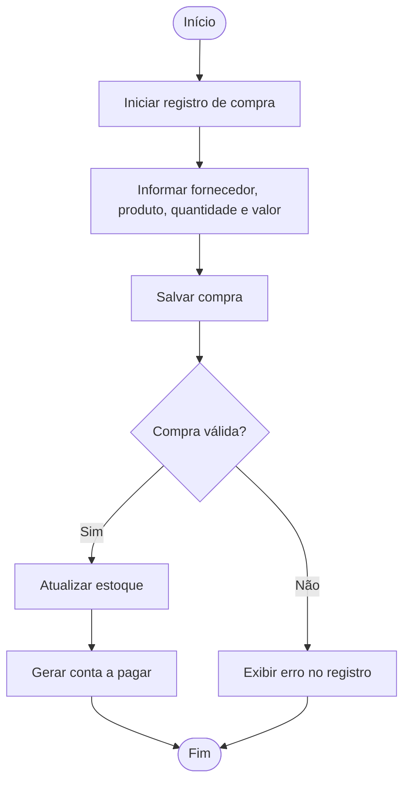

---

## UC12 — Gerar Conta a Pagar

**Ator(es):** Financeiro  
**Descrição:** Permite registrar obrigações financeiras decorrentes de compras e despesas.  
**Pré-condições:** Compra ou despesa previamente registrada.  
**Pós-condições:** Conta a pagar registrada com status em aberto.  

### Fluxo Principal
1. O financeiro recebe os dados da compra ou despesa.  
2. O sistema confirma valor, descrição e vencimento.  
3. O sistema registra a conta a pagar.  
4. O sistema define o status inicial como aberta.  

### Fluxos Alternativos / Exceções
- **FA01** — Dados inconsistentes; o sistema informa erro.  
- **FA02** — Campo obrigatório não preenchido; o sistema solicita ajuste.  

### Relacionamentos
- **Include:** não se aplica  
- **Extend:** não se aplica  

### Diagrama de Atividades

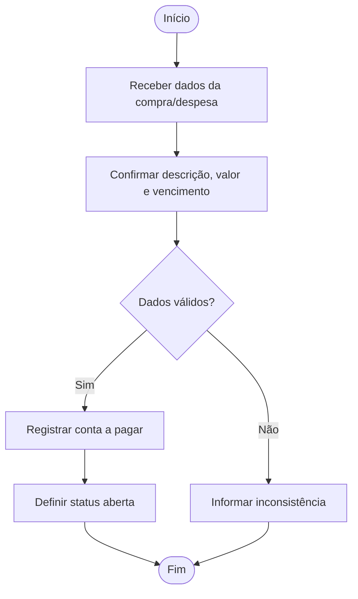

---

# 5. Casos de Uso — Diagrama Geral

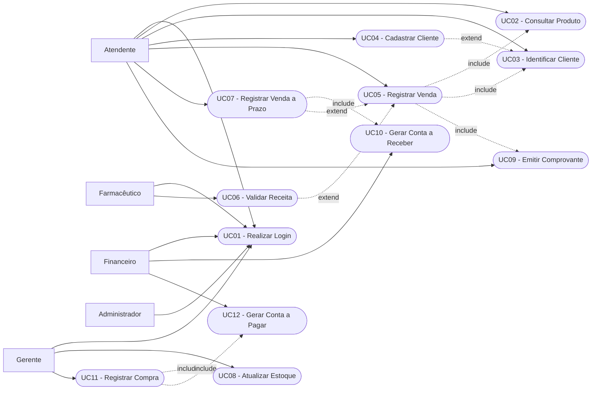
